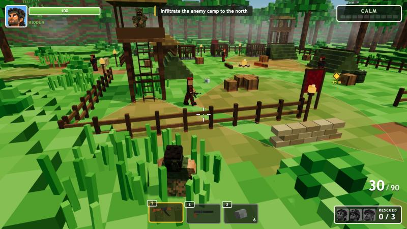

# Headband Hero

A voxel stealth-action game for the browser. A muscular commando in a dark cloth headband is dropped by helicopter at the edge of a misty jungle. Infiltrate the enemy camp, free the captured soldiers, and get everyone to the extraction helicopter. Sneak and pick guards off quietly, or go loud with the rifle and fight your way out. Gunfire is loud: going loud brings the whole camp down on you.

Stylized cartoon action, no blood or gore. Eliminated characters burst into a puff of voxel cubes.

**Play:** https://techsnazzy.github.io/headband-hero-game/



## Status

Level 1 (Misty Ridge) is playable start to finish. See [PLAN.md](PLAN.md) for milestones and what comes next.

## Features

- Helicopter insertion: the chopper flies in over a misty ridge and the hero fast-ropes to the landing zone.
- Angled 3/4 chase camera with a slight over-the-shoulder offset, wall pull-in and fading trees. Built as a swappable `CameraMode` system (F9 cycles modes once more exist).
- Stealth: guards with ground vision cones, `?`/`!` alert icons, a camp alert meter and hearing based on walking, sprinting, crouching, jumping and gunfire. Hide in tall grass and bushes; guard dogs can smell you there.
- Silent takedowns from behind (hold E), thrown rocks to lure guards, a suppressed pistol (one-shot headshots), and a loud full-auto rifle that brings the whole camp down on you.
- Enemies: grunts, tower snipers (with a laser that telegraphs the shot), a dog handler and his guard dog. Alerted guards call for help, flank, chase and search before cooling down.
- Rescue three captured soldiers from bamboo cages; they follow you (and sneak when you sneak). Allies can never be hurt: bullets pass through and the crosshair shows FRIENDLY.
- Extraction: get everyone to the chopper, then hold out against reinforcement waves while it warms up.
- Cartoon combat with no blood: hit sparks, voxel debris, and eliminated characters burst into a puff of cubes.
- HUD: crosshair with dynamic spread, hit markers, ammo and reload ring, hotbar (icons rendered from the in-game voxel models), health with regen, alert meter, rescued portraits, objective text and a waypoint marker.
- Checkpoints, title/pause/controls/settings screens, win screen with stats (and a GHOST rating if you are never spotted).
- Procedural WebAudio sound effects and an adaptive music bed that kicks in when the camp is alerted.
- Gamepad support (standard mapping).

## Controls

| Input | Action |
| --- | --- |
| Mouse | Look and aim (click the game to lock the pointer) |
| W A S D | Move relative to the camera |
| Left click | Fire (hold for full auto on the rifle; throws a rock in slot 3) |
| Right click or R | Reload |
| Shift | Sprint (fast, noisy) |
| C or Ctrl | Crouch / sneak (slow, quiet, hide in tall grass and bushes) |
| Space | Hop (noisy) |
| E (hold) | Interact: free captives, open crates, pick up items, silent takedown from behind |
| 1, 2, 3 or mouse wheel | Switch equipment: rifle, suppressed pistol, rocks |
| Esc | Pause menu |
| F9 | Debug: cycle camera modes (once more than one exists) |

Gamepad (standard mapping): left stick move, right stick look, RT fire, X reload, A hop, B crouch, LB/RB interact, Y next equipment, D-pad left/up/right for slots 1/2/3, left stick click sprint, Start pause.

Settings (mouse sensitivity, invert Y, volume, music, aim assist) are in the title and pause menus and are saved in the browser. All gameplay tuning numbers live in [`src/config/tuning.ts`](src/config/tuning.ts).

## Run locally

Requires Node 20 or newer.

```bash
npm install
npm run dev
```

Then open http://localhost:5173/headband-hero-game/.

## Build

```bash
npm run build
npm run preview
```

The production build lands in `dist/`.

Other scripts: `npm run lint`, `npm run format`, `npm run typecheck`.

## Deploy

Every push to `main` runs [.github/workflows/deploy.yml](.github/workflows/deploy.yml), which lints, builds with Vite and publishes `dist/` to GitHub Pages. Pages is configured with **GitHub Actions** as the source. `vite.config.ts` sets `base: '/headband-hero-game/'` to match the Pages path.

## Folder structure

```
assets/          Source art and audio (concept art, textures, UI, audio). See ASSETS.md.
docs/            Notes and screenshots.
public/          Static files copied as-is into the build (runtime images, sounds).
src/
  main.ts        Entry point
  game/          Game loop, state machine, mission flow, checkpoints, intro, extraction, pickups, interactions
  config/        tuning.ts (all gameplay numbers), palette.ts (colors)
  camera/        CameraMode interface, CameraRig, ChaseCamera
  input/         Keyboard, mouse, pointer lock
  world/         Voxel terrain, colliders, ray casts, props, foliage
  characters/    Shared voxel humanoid rig (two-bone arm IK) and character looks
  player/        Hero controller and silent takedown
  weapons/       Weapons and their voxel models
  enemies/       Guard and dog models, health, hitboxes
  ai/            Perception, hearing, alert states, guard brain
  allies/        Captives, cages and followers
  levels/        Level data (Level 1 plus room for 2 to 6)
  fx/            Particles, tracers, voxel debris
  ui/            HUD and menus
  audio/         Sound manager
  assets/        Asset loader helpers
```

## Credits

- Built with [Three.js](https://threejs.org/), [Vite](https://vitejs.dev/) and [TypeScript](https://www.typescriptlang.org/).
- Concept art, title key art, logo and website thumbnail made with [Higgsfield](https://higgsfield.ai/) (GPT Image 2.5). See [ASSETS.md](ASSETS.md).
- Sound effects and music are synthesized at runtime with the Web Audio API.
- All 3D models are built procedurally from voxel boxes in code.
- Code written with [Claude Code](https://claude.com/claude-code).

## License

Licensing is undecided. All rights reserved for now.
